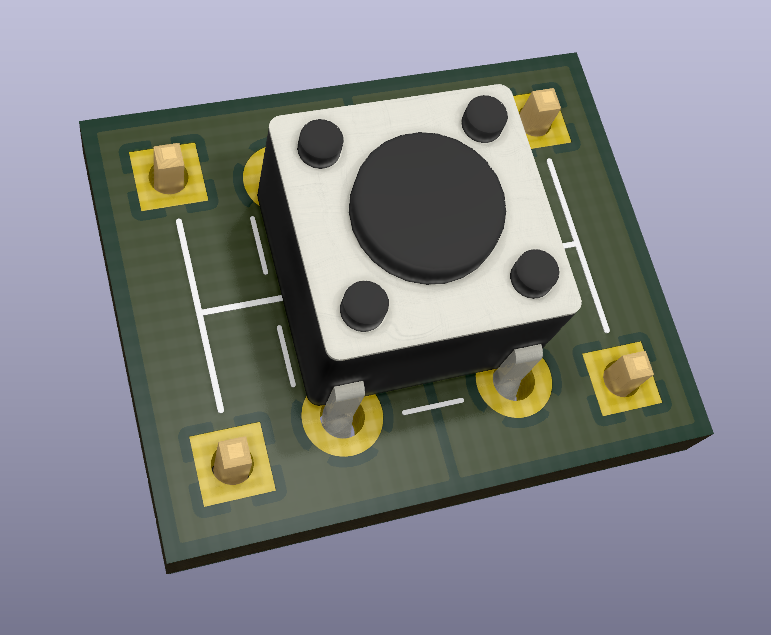

# Tactile_Switch_Adapter
An adapter board for using standard 6MM PTH tactile switches with solderless breadboards

# Project Description
After getting frustrated with 6mm tactile switches constantly falling out of my breadboard prototypes, I decided to design this adapter PCB to allow for a more solid, pin header connection. There is also a footprint for an optional 0603 debouncing capacitor on the bottom side of the board.

# License
MKE supports the open source hardware community by sharing hardware design files freely on GitHub!

Please support MKE by purchasing products on [Tindie](https://www.tindie.com/stores/mkengineering/)!

Designed by Mike Kushnerik for MKEngineering

Licensed under [Creative Commons Attribution-ShareAlike CC BY-SA 3.0](http://creativecommons.org/licenses/by-sa/3.0/)

All text above must be included in any redistribution!
